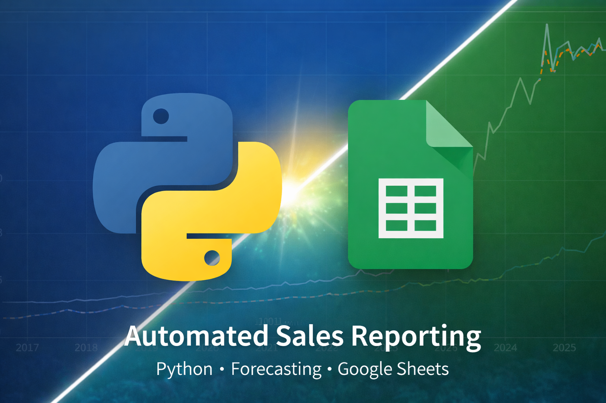
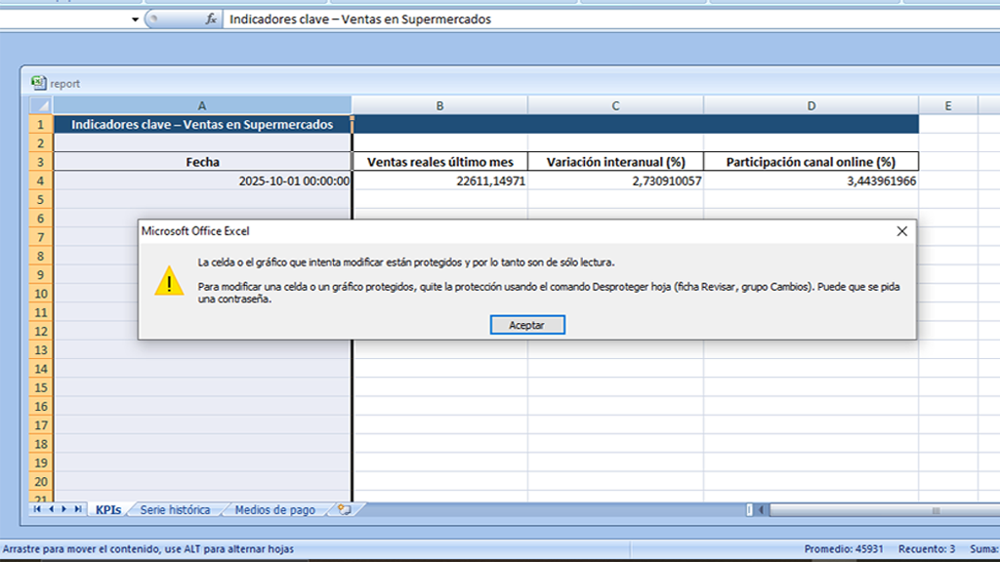
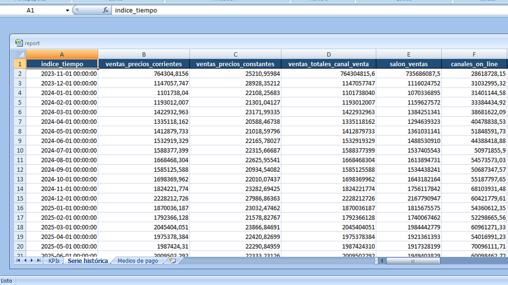
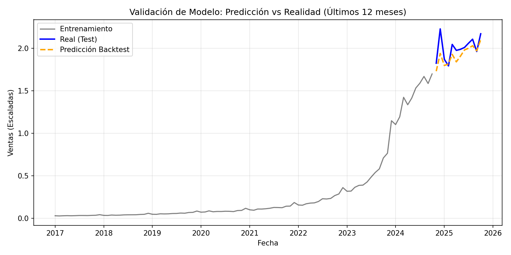
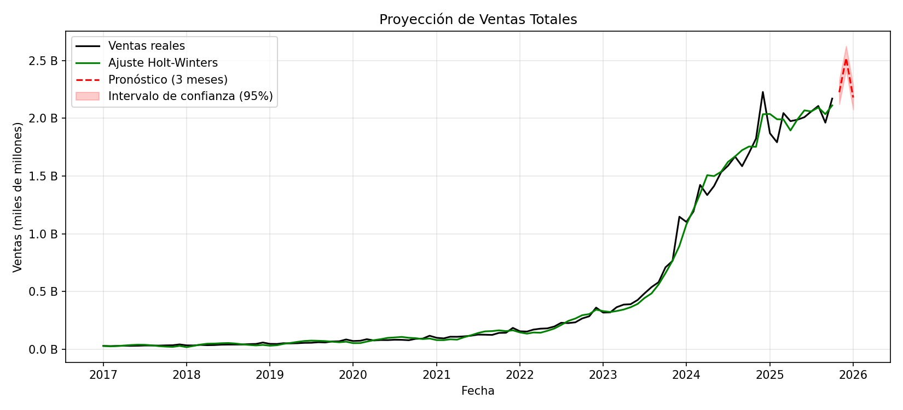
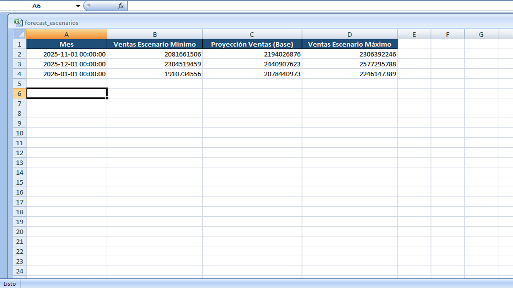
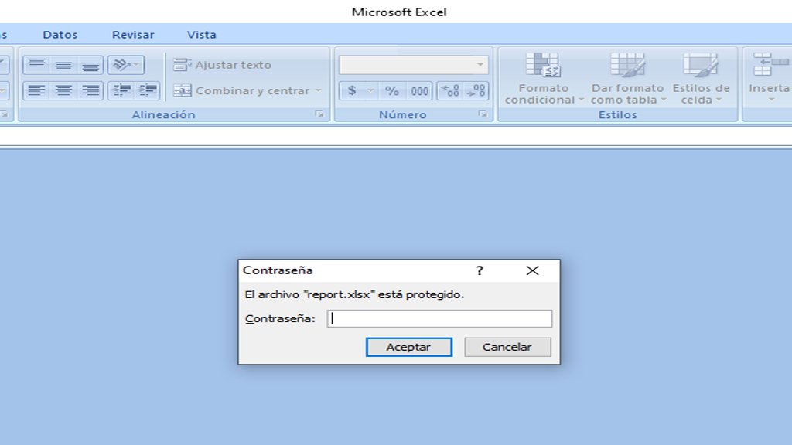
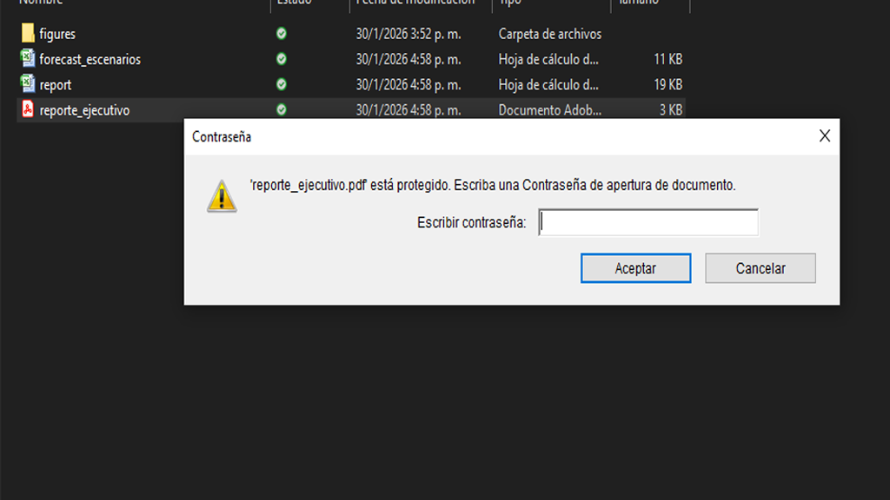

# Automatización de Reportes y predicción de Ventas


-------------------

## Tabla de Contenido

- [Sobre el proyecto](#sobre-el-proyecto)
- [Beneficios para tu negocio](#beneficios-para-tu-negocio)
- [¿Cómo funciona?](#cómo-funciona)
- [Tecnologías utilizadas](#Tecnologías-utilizadas)
- [Cómo probarlo](#cómo-probarlo)
- [Ejemplos de salida](#ejemplos-de-salida)
  - [Reporte de ventas (Excel)](#reporte-de-ventas-excel)
  - [Predicción de ventas](#predicción-de-ventas)
    - [Validación del modelo](#validación-del-modelo)
- [Seguridad y privacidad de los datos](#Seguridad-y-Privacidad-de-Datos)    
- [Fuente de datos](#fuente-de-datos)
- [Aviso legal](#aviso-legal)
- [License / Licencia](#License--Licencia)
- [Contacto / Contact](#contacto--contact)
- [Sobre mí](#sobre-mí)

----------------------
## *Sobre el proyecto*
Este sistema automático genera reportes de ventas en Excel y PDF usando datos reales, calcula indicadores clave (KPIs), crea gráficos, hace predicciones sobre el total de futuras ventas y envía por email los archivos resultantes de la ejecución. Ideal para crear informes periódicos sin intervención manual.

----------------------
## Beneficios para tu negocio

- Ahorra tiempo y esfuerzo cada mes.
- Genera reportes listos para dirección o reuniones.
- Predice ventas esperadas a partir de la tendencia y los datos históricos.
- Envía informes automáticamente por correo electrónico  
  *(funcionalidad desactivada por defecto; requiere configurar emisor y receptor. Se recomienda usar variables de entorno para no exponer datos sensibles).*  
- Reduce errores asociados a reportes manuales.

-------------------
## ¿Cómo funciona?
1. Se descargan y limpian los datos.
2. Se calculan KPIs importantes (ventas totales, tendencia, etc.).
3. Se generan gráficos y un PDF ejecutivo.
4. Se exporta un Excel detallado.
5. Se envía el informe por email automáticamente.
<!--Barra de navegación -->
<p align="center">
  <a href="#Sobre-el-proyecto" title="Anterior">⬅️</a>
  <a href="#Tabla-de-Contenido" title="Volver al inicio">|🏠|</a>
  <a href="#Cómo-probarlo" title="Siguiente">➡️</a>
</p>   
  

-------------------

## Tecnologías utilizadas

- **Python 3.9**
- **pandas**   
  Manipulación y análisis de datos.
- **matplotlib** 
  Generación de gráficos y visualizaciones.
- **reportlab**  
  Creación de reportes ejecutivos en PDF.
- **openpyxl**  
  Generación de archivos Excel con múltiples hojas.
- **statsmodels**  
  Modelado estadístico y predicción de series de tiempo (Holt-Winters).

----------------------

##  Cómo probarlo.
Para probar el sistema sigue estos pasos.
1. Clona este repositorio:
```bash
git clone https://github.com/juancaalcaraz/automatizacion-de-reportes-de-ventas.git
```
2. Abrí el directorio del proyecto:
```bash
cd automatizacion-de-reportes-de-ventas
```
3. Instala las dependencias del sistema:
```bash
# instalar dependencias
pip install -r requirements.txt
```
4. Ejecuta el archivo main.py 
```bash
# ejecutar
python main.py
```
Esto generará los reportes de ventas y las predicciones de los próximos 3 meses en la carpeta outputs la cual se genera tras la primer ejecución. 
### **Nota técnica**
Por defecto se usa el archivo csv de ventas de supermercados en argentina el cual se descarga directamente desde la URL del data set. Para proporcionar otro origen de datos debes hacerlo a traves del archivo config.py en la constante URL.

<!--Barra de navegación -->
<p align="center"> 
  <a href="#cómo-funciona" title="Anterior">⬅️</a>
  <a href="#Tabla-de-Contenido" title="Volver al inicio">|🏠|</a> 
  <a href="#Ejemplos-de-salida" title="Siguiente">➡️</a>
</p>  
  

-------------------
## Ejemplos de salida

### Reporte de ventas (Excel)

**Primera hoja del reporte**  
Muestra los KPI de ventas reales del último mes, la variación interanual y la participación de los canales online.



**Segunda hoja del reporte**  
Contiene el historial de ventas utilizado para el análisis y la predicción.



### Predicción de ventas
Originalmente, el sistema se desarrolló utilizando el modelo Holt-Winters (Suavizado Exponencial Triple). Tras una fase de validación y mejora, se migró hacia ETS (Error-Trend-Seasonal) como motor principal. Este modelo se entrena cada ves que el sistema se ejecuta, actualizando sus estimaciones con la información más reciente.

#### **Validación del modelo**
Antes de entrenarse con todo el data set, el modelo realizo predicciones para el último año de ventas registrados en el data set. Luego estas predicciones fueron comparadas con los valores reales.   


#### Gráfico que muestra la tendencia histórica de ventas junto con la  predicción para los próximos **3 meses** y sus intervalos de variación. La **línea roja discontinua** representa la predicción del **modelo probabilístico**, mientras que el área sombreada indica el rango esperado de variación.


#### Excel generado con las predicciónes para los futúros 3 meses de ventas. *Aclaración*: La última actualización del data set al ejecutarse este sistema fue en octubre del 2025.   


<!--Barra de navegación -->
<p align="center">  
  <a href="#Cómo-probarlo" title="Anterior">⬅️</a>
  <a href="#Tabla-de-Contenido" title="Volver al inicio">|🏠|</a>
  <a href="#Seguridad-y-Privacidad-de-Datos" title="Siguiente">➡️</a>
</p>   
  

-----------------------------------------------------------------------
## Seguridad y Privacidad de Datos
  Este sistema implementa múltiples capas de seguridad para proteger la información estratégica y grantizar la transparencia de los modelos predictivos:
* **Cifrado de Acceso (Capa Externa):** Tanto los reportes en **PDF** como los archivos **Excel** utilizan cifrado de acceso. Ningún usuario puede abrir o visualizar los datos sin la contraseña maestra definida de forma segura en las variables de entorno (`.env`).
* **Control de Permisos y Solo Lectura (Capa Interna PDF):** Se implementó una distinción entre *User* y *Owner password*. Los reportes PDF están configurados por defecto con **restricciones de impresión y copiado de texto**, asegurando que la información solo sea consultada en entornos digitales controlados.
* **Inmutabilidad del Forecast (Capa de Integridad):** Para evitar la manipulación de los resultados estadísticos, las hojas de predicciones en Excel se sellan con una **clave aleatoria generada en tiempo de ejecución**. Esto garantiza que ni el usuario ni terceros puedan alterar los valores del modelo *ETSModels*, preservando la integridad de la auditoría.
* **Protección de Estructura (Excel):** Mediante el motor `openpyxl`, se bloquea la edición de celdas y el formato de las hojas, evitando errores accidentales o modificaciones malintencionadas en los datos reportados.
* **Arquitectura Desacoplada:** La lógica de protección reside en un módulo independiente (`src/security.py`), lo que permite escalar el sistema para integrar gestores de secretos sin afectar el núcleo del análisis de datos.
### Evidencia de Protección

Para garantizar la integridad de los datos, los archivos generados requieren autenticación para su apertura:

| Protección de Excel | Protección de PDF |
| :---: | :---: |
|  |  |
| *Acceso restringido a datos crudos* | *Reporte ejecutivo cifrado* |

> [!IMPORTANT]
> **Configuración de Seguridad:** La contraseña por defecto se define en la variable `PASSWORD` dentro del archivo `.env`. Utiliza el archivo `.env.example` como plantilla (renombrándolo a `.env`) para configurar tus credenciales personales antes de ejecutar el sistema.

-------------------
## Fuente de datos

Los datos utilizados provienen del portal de Datos Abiertos del Gobierno de la República Argentina  
Dataset: [**Ventas en supermercados**](https://www.datos.gob.ar/sv/dataset/sspm-ventas-supermercados/archivo/sspm_455.1)

Fuente: https://datos.gob.ar  
Los datos se utilizan con fines demostrativos y educativos.

## Aviso legal:
> Los reportes y visualizaciones presentados son ejemplos generados a partir de datos abiertos y no representan información comercial confidencial.

## License / Licencia

**EN:** This project is licensed for **personal, educational, and evaluation use only**.  
Commercial use is **not permitted** without explicit permission from the author.  
If you are interested in a commercial license or a customized version, feel free to contact me.

**ES:** Este proyecto está autorizado únicamente para **uso personal, educativo y de evaluación**.  
El uso comercial **no está permitido** sin el permiso explícito del autor.  
Si estás interesado en una licencia comercial o una versión personalizada de este sistema, no dudes en contactarme.

## Contact/ Contacto
You can also reach me via LinkedIn/ Puedes contactarme via LinkedIn: [**User LinkedIn**](https://www.linkedin.com/in/juan-carlos-alcaraz-424a571b4/) 

Or via E-mail: 


-----------------
# Sobre mí

¡Hola! Me llamo Juan Alcaraz y soy Técnico Superior en Ciencias de Datos e Inteligencia Artificial. Desarrollo soluciones de automatización para análisis y reporting. Creo dashboards para la toma de decisiones estratégicas. Aplico soluciones de Inteligencia Artificial y entreno modelos de Machine Learning y Deep Learning para los negocios que lo requieran. 

<p align="center">
  <a href="#Tabla-de-Contenido" title="Volver al inicio">🏠</a> | 
  <a href="#License--Licencia" title="Anterior">⬅️</a>
</p>   

