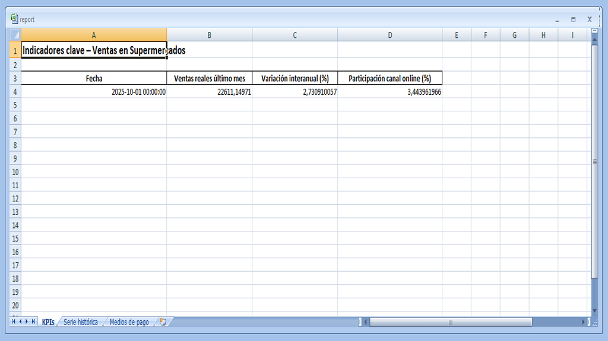
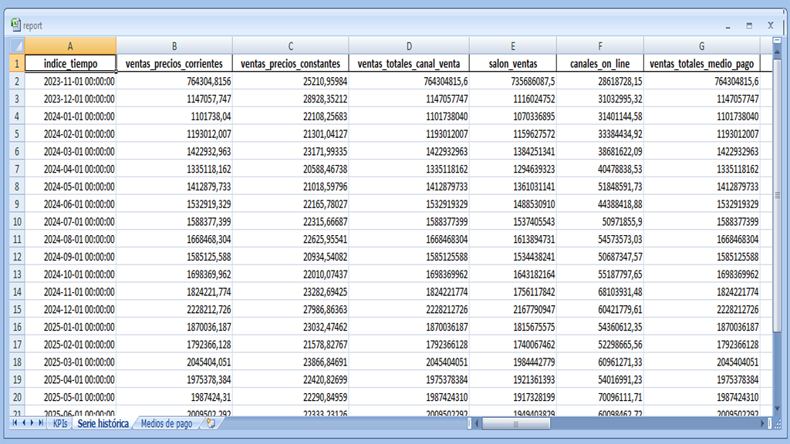

# Automatización de Reportes y predicción de Ventas

## *Sobre el proyecto*
Este sistema automático genera reportes de ventas en Excel y PDF usando datos reales, calcula indicadores clave (KPIs), crea gráficos, hace predicciones del total de futuras ventas y envía por email los archivos resultantes de la ejecución. Ideal para crear informes periódicos sin intervención manual.

## Beneficios para tu negocio

- Ahorra tiempo y esfuerzo cada mes.
- Genera reportes listos para dirección o reuniones.
- Predice ventas esperadas a partir de la tendencia y los datos históricos.
- Envía informes automáticamente por correo electrónico  
  *(funcionalidad desactivada por defecto; requiere configurar emisor y receptor. Se recomienda usar variables de entorno para no exponer datos sensibles).*  
- Reduce errores asociados a reportes manuales.

## ¿Cómo funciona?
1. Se descargan y limpian los datos.
2. Se calculan KPIs importantes (ventas totales, tendencia, etc.).
3. Se generan gráficos y un PDF ejecutivo.
4. Se exporta un Excel detallado.
5. Se envía el informe por email automáticamente.

##  Cómo probarlo.
Para probar el sistema sigue estos pasos.
1. Clona este repositorio:
```bash
git clone https://github.com/juancaalcaraz/automatizacion-de-reportes-de-ventas.git
```
2. Abrí el directorio del proyecto:
```bash
cd automatizacion-de-reportes-de-ventas
```
3. Instala las dependencias del sistema:
```bash
# instalar dependencias
pip install -r requirements.txt
```
4. Ejecuta el archivo main.py 
```bash
# ejecutar
python main.py
```
## Ejemplos de salida

### Reporte de ventas (Excel)

**Primera hoja del reporte**  
Muestra los KPI de ventas reales del último mes, la variación interanual y la participación de los canales online.



**Segunda hoja del reporte**  
Contiene el historial de ventas utilizado para el análisis y la predicción.



---

### Predicción de ventas

Gráfico que muestra la tendencia histórica de ventas junto con la predicción para los próximos **3 meses** y sus intervalos de variación.  
La **línea roja discontinua** representa la predicción del **modelo probabilístico**, mientras que el área sombreada indica el rango esperado de variación.


-----------------------------------------------------------------------
# Sobre mí

Soy Técnico Superior en Ciencias de Datos e Inteligencia Artificial. Desarrollo soluciones de automatización para análisis y reporting, Creo dashboard para la toma de decisiones estratégicas y aplico soluciones de IA para los negocios que lo requieran.

## Fuente de datos

Los datos utilizados provienen del portal de Datos Abiertos del Gobierno de la República Argentina  
Dataset: [**Ventas en supermercados**](https://www.datos.gob.ar/sv/dataset/sspm-ventas-supermercados/archivo/sspm_455.1)

Fuente: https://datos.gob.ar  
Los datos se utilizan con fines demostrativos y educativos.


## Aviso legal:
> Los reportes y visualizaciones presentados son ejemplos generados a partir de datos abiertos y no representan información comercial confidencial.

